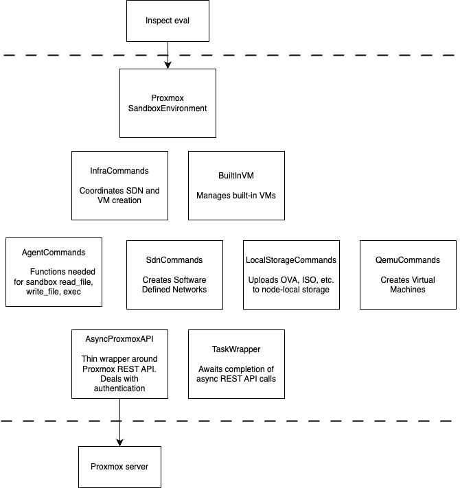

# Contributing Guide

**NOTE:** If you have any feature requests or suggestions, we'd love to hear about them
and discuss them with you before you raise a PR. Please come discuss your ideas with us
in our [Inspect
Community](https://join.slack.com/t/inspectcommunity/shared_invite/zt-2w9eaeusj-4Hu~IBHx2aORsKz~njuz4g)
Slack workspace.

## Getting started

This project uses [uv](https://github.com/astral-sh/uv) for Python packaging.

Run this beforehand:

```
uv sync
```

You then can either source the venv with

```
source .venv/bin/activate
```

or prefix your pytest (etc.) commands with `uv run ...`

## Setting up a Proxmox instance for testing

You'll need a Proxmox instance to develop against. Two supported paths; both
handle the extra configuration mentioned in this project's README, and apply the
patch from https://lists.proxmox.com/pipermail/pve-devel/2025-November/076472.html

### Local (Ubuntu 24.04 host)

To spin up a Proxmox instance on a local Ubuntu 24.04 machine, use the script
`src/proxmoxsandbox/scripts/virtualized_proxmox/build_proxmox_auto.sh`.

### EC2

You can run Proxmox on an EC2 `m8i` instance with nested virtualization.
The intended workflow is to build a Proxmox AMI once, then launch from it many times. See
[`src/proxmoxsandbox/scripts/ec2/README.md`](src/proxmoxsandbox/scripts/ec2/README.md).

Such proxmox servers require `PROXMOX_IMAGE_STORAGE=local` as they have no lvm storage.

## Tests

To run the tests, you will need a Proxmox instance and an `.env` file per README.md.

If running from the CLI, you'll need to run first `set -a; source .env; set +a`.

Then run:

```
uv run pytest
```

The tests require your Proxmox node to have at least 3 vCPUs available.

### Windows VM Tests

By default, tests run against Linux VMs using the built-in `ubuntu24.04` image.

To also run tests against Windows VMs:

1. Create a Windows VM on your Proxmox server with `qemu-guest-agent` installed and running
2. Convert it to a template (right-click → Convert to Template)
3. Add tags `inspect;<your-tag>` to the template (e.g., `inspect;windows-test`)
4. Set the environment variable:

```bash
export PROXMOX_WINDOWS_TEMPLATE_TAG=<your-tag>
```

With this set, tests in `test_proxmox_sandbox_agent_commands.py` will run for both Linux and Windows.

### Debug logging

To see debug-level log output while running tests:

```
uv run pytest --log-cli-level=DEBUG
```

The `httpcore` and `httpx` loggers are set to `WARNING` in `conftest.py` to suppress
their per-request connection/TLS/header noise, which otherwise drowns out application
logs. If you need to debug HTTP-level issues, temporarily comment out the
`setLevel(logging.WARNING)` lines in `tests/proxmoxsandboxtest/conftest.py`.

## Linting & Formatting

[Ruff](https://docs.astral.sh/ruff/) is used for linting and formatting. To run both
checks manually:

```bash
uv run ruff check .
uv run ruff format .
```

## Type Checking

[Mypy](https://github.com/python/mypy) is used for type checking. To run type checks
manually:

```bash
uv run mypy
```

## Design Notes

All communication with Proxmox is via the AsyncProxmoxAPI class.



### Lack of URL constants

The URLs for each REST call tend to be inline in the part of the code making the call; 
this is deliberate, to keep things simple and to avoid premature indirection. 


### Limitations

The design of this provider is constrained by what is offered by the 
[Proxmox REST API](https://pve.proxmox.com/wiki/Proxmox_VE_API). 

For example, there is no way to upload arbitrary large files directly to the server, other
than qcow2 and OVA files.

For VM and SDN zone deletions, the Proxmox API has been observed to return HTTP 500 (not 404)
when the resource does not exist. The cleanup code checks for 500 + "does not exist" in the
response body to distinguish this from genuine errors.

### Cleanup

There are two paths for cleaning up resources. The normal, "happy", path is via `sample_cleanup()`, which uses
`ProxmoxSandboxEnvironment`'s `all_vm_ids`, `sdn_zone_id`, and `all_ipam_mappings` fields. These are populated
during sample setup and passed explicitly to `InfraCommands.delete_sdn_and_vms()`.

However, the user can press Ctrl-C, per the [Inspect docs](https://inspect.aisi.org.uk/sandboxing.html#environment-cleanup).
In this case `sample_cleanup` is skipped and `task_cleanup()` handles teardown instead. `QemuCommands` tracks
created VM IDs and `SdnCommands` tracks created SDN zones and IPAM mappings, each as instance attributes. A single
shared `InfraCommands` instance (which owns these collaborators) is created in `task_init()` and stored in a
class-level dict keyed by `ProxmoxTarget(host, port, node)`, so that `task_cleanup()` can retrieve it and delegate
cleanup to each collaborator for any resources not already cleaned up by `sample_cleanup`.