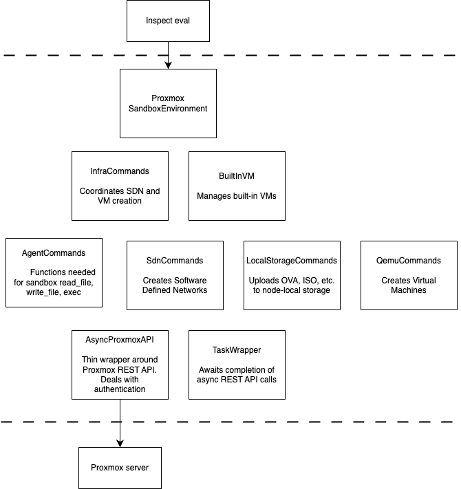

# Contributing Guide

**NOTE:** If you have any feature requests or suggestions, we'd love to hear about them
and discuss them with you before you raise a PR. Please come discuss your ideas with us
in our [Inspect
Community](https://join.slack.com/t/inspectcommunity/shared_invite/zt-2w9eaeusj-4Hu~IBHx2aORsKz~njuz4g)
Slack workspace.

## Before you open a PR

This provider is a thin layer over infrastructure we don't control — the Proxmox REST
API and the QEMU guest agent. Most bugs in it are claims about what that infrastructure
does at runtime, and those are cheap to get wrong from reading documentation or upstream
source.

If your change asserts a runtime behaviour, we need the observation, not the derivation.

- **Run it against a real Proxmox host and paste what you saw.** A local or EC2-hosted
  instance is fine — see below. The `req_proxmox` marker identifies the tests that need
  one. A test without that marker is not evidence about runtime behaviour, however green
  it is.
- **Show the negative control.** Give the result with your change and without it. If you
  can't produce a run that fails on `main` and passes on your branch, say so and explain
  why.
- **If you can't run it, open an issue rather than a PR.** Reasoning, upstream source
  links and a proposed patch are all welcome in an issue. A confidently argued wrong
  premise costs more than no PR at all, because it has to be disproved before it can be
  declined.

Two traps specific to this repo. The QEMU guest agent channel on Windows drops roughly
5–7% of calls, so a single passing run is weak evidence — repeat it and report the counts
(`5/5`). And the Proxmox API returns HTTP 500 rather than 404 for resources that don't
exist, so error-path claims in particular can't be settled from the API docs.

A sufficient experiment looks like: baseline without the change, the behaviour with it,
then baseline again to show the effect went away — several attempts per phase, plus a
positive control proving the test could have observed a difference if there were one.

## Getting started

This project uses [uv](https://github.com/astral-sh/uv) for Python packaging.

Run this beforehand:

```
uv sync
```

The commands below are written as `uv run ...`, which works whether or not the venv is
activated. Drop the prefix if you'd rather activate it:

```
source .venv/bin/activate
```

## Setting up a Proxmox instance for testing

You'll need a Proxmox instance to develop against. Two supported paths; both
handle the extra configuration mentioned in this project's README, apply the
patch from https://lists.proxmox.com/pipermail/pve-devel/2025-November/076472.html,
and configure host firewall isolation (see the README's "Host firewall isolation"
section; the rules are inlined into both provisioning scripts — keep the two in
sync).

### Local (Ubuntu 24.04 host)

To spin up a Proxmox instance on a local Ubuntu 24.04 machine, use the script
`src/proxmoxsandbox/scripts/virtualized_proxmox/build_proxmox_auto.sh`.

### EC2

You can run Proxmox on an EC2 `m8i` instance with nested virtualization.
The intended workflow is to build a Proxmox AMI once, then launch from it many times. See
[`src/proxmoxsandbox/scripts/ec2/README.md`](src/proxmoxsandbox/scripts/ec2/README.md).

Such proxmox servers require `PROXMOX_IMAGE_STORAGE=local` as they have no lvm storage.

## Testing

To run the tests, you will need a Proxmox instance and an `.env` file per README.md.

If running from the CLI, you'll need to run first `set -a; source .env; set +a`.

Then run:

```
uv run pytest
```

The tests require your Proxmox node to have at least 3 vCPUs available.

Tests that need a host carry the `req_proxmox` marker, so to run only those that don't:

```
uv run pytest -m "not req_proxmox"
```

### Windows VM Tests

By default, tests run against Linux VMs using the built-in `ubuntu24.04` image.

To also run tests against Windows VMs:

1. Create a Windows VM on your Proxmox server with `qemu-guest-agent` installed and running
2. Convert it to a template (right-click → Convert to Template)
3. Add tags `inspect;<your-tag>` to the template (e.g., `inspect;windows-test`)
4. Set the environment variable:

```bash
export PROXMOX_WINDOWS_TEMPLATE_TAG=<your-tag>
```

With this set, tests in `test_proxmox_sandbox_agent_commands.py` will run for both Linux and Windows.

### Egress lockdown test

`test_egress_lockdown_e2e.py` is skipped unless `PROXMOX_EGRESS_LOCKDOWN_ENABLED`
is set, because it needs the host's egress lockdown active — and a locked-down
host fails other integration tests that expect guests to have egress.

The built-in VM template must already exist on the host before locking down:
baking it boots the source image and installs packages (including
`qemu-guest-agent`) from inside the guest, which needs guest egress. Any test
that creates a default sandbox (e.g. `test_host_isolation_e2e.py`) bakes it on
first use. Then:

```bash
ssh root@<proxmox-host> 'touch /etc/inspect-proxmox-egress-lockdown && systemctl start inspect-proxmox-egress-lockdown.service'
PROXMOX_EGRESS_LOCKDOWN_ENABLED=1 uv run pytest tests/proxmoxsandboxtest/test_egress_lockdown_e2e.py
ssh root@<proxmox-host> 'rm /etc/inspect-proxmox-egress-lockdown && systemctl start inspect-proxmox-egress-lockdown.service'
```

Remember the last step: leaving the marker in place breaks the rest of the
integration suite.

### Debug logging

To see debug-level log output while running tests:

```
uv run pytest --log-cli-level=DEBUG
```

The `httpcore` and `httpx` loggers are set to `WARNING` in `conftest.py` to suppress
their per-request connection/TLS/header noise, which otherwise drowns out application
logs. If you need to debug HTTP-level issues, temporarily comment out the
`setLevel(logging.WARNING)` lines in `tests/proxmoxsandboxtest/conftest.py`.

## Linting & Formatting

[Ruff](https://docs.astral.sh/ruff/) is used for linting and formatting. To run both
checks manually:

```bash
uv run ruff check .
uv run ruff format .
```

## Type Checking

[Mypy](https://github.com/python/mypy) is used for type checking. To run type checks
manually:

```bash
uv run mypy
```

## Changelog

If appropriate, add an entry under the `## Unreleased` heading in `CHANGELOG.md` when
submitting a PR. Create that heading if the last release consumed it.

Entries under a dated release heading are published history — don't add to or edit
them. In particular, if a release is cut after you branch, a stale branch can silently
land your entry in the just-released section (the release commit renames `##
Unreleased` to the dated heading, so your diff still applies): after rebasing onto
`main`, check your entry still sits under `## Unreleased`.

## Conventions

### Package Structure and API Visibility

The Python packages, modules and members follow a similar API visibility naming
convention to that used in the [inspect_ai](https://inspect.aisi.org.uk/) package.

The public surface is `schema.py` (the config models an eval imports) and the
`proxmox-sandbox` entry point. Everything else is internal.

Module-private members are prefixed with an underscore `_`. These members are not
intended for use outside of the module in which they are defined (except in tests).

Class-private members are prefixed with an underscore `_`. These members are not
intended for use outside of the class in which they are defined (except in tests). We
don't use double underscores `__`  which is consistent with [Google's Python style
guide](https://google.github.io/styleguide/pyguide.html).

Non-public modules (i.e. .py files) are prefixed with an underscore `_` (unless a parent
package is already prefixed with an underscore).

## Design Notes

All communication with Proxmox is via the AsyncProxmoxAPI class.



### Lack of URL constants

The URLs for each REST call tend to be inline in the part of the code making the call; 
this is deliberate, to keep things simple and to avoid premature indirection. 


### Limitations

The design of this provider is constrained by what is offered by the 
[Proxmox REST API](https://pve.proxmox.com/wiki/Proxmox_VE_API). 

For example, there is no way to upload arbitrary large files directly to the server, other
than qcow2 and OVA files.

For VM and SDN zone deletions, the Proxmox API has been observed to return HTTP 500 (not 404)
when the resource does not exist. The cleanup code checks for 500 + "does not exist" in the
response body to distinguish this from genuine errors.

### Cleanup

There are two paths for cleaning up resources. The normal, "happy", path is via `sample_cleanup()`, which uses
`ProxmoxSandboxEnvironment`'s `all_vm_ids`, `sdn_zone_id`, and `all_ipam_mappings` fields. These are populated
during sample setup and passed explicitly to `InfraCommands.delete_sdn_and_vms()`.

However, the user can press Ctrl-C, per the [Inspect docs](https://inspect.aisi.org.uk/sandboxing.html#environment-cleanup).
In this case `sample_cleanup` is skipped and `task_cleanup()` handles teardown instead. `QemuCommands` tracks
created VM IDs and `SdnCommands` tracks created SDN zones and IPAM mappings, each as instance attributes. A single
shared `InfraCommands` instance (which owns these collaborators) is created in `task_init()` and stored in a
class-level dict keyed by `ProxmoxTarget(host, port, node)`, so that `task_cleanup()` can retrieve it and delegate
cleanup to each collaborator for any resources not already cleaned up by `sample_cleanup`.